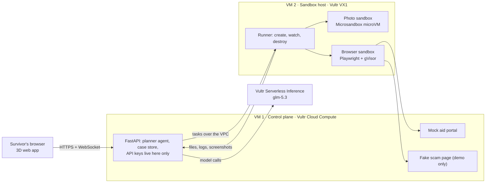

# Architecture

The diagram version is in [design/blueprint.html](../design/blueprint.html). This file is the text version agents should read.

## Components

- Only VM 1 has public ports (80, 443). VM 2 accepts SSH from the team's IPs and runner traffic from VM 1 over the VPC, nothing else.
- The model only suggests. VM 1 decides what to run, and VM 2 runs it inside a sandbox.

## User flow

1. Survivor starts a case and uploads photos (or a short video) of the room.
2. The photo sandbox runs the depth model and returns `room.glb`. The front end shows the 3D room.
3. The vision model labels damage. The agent writes Python to measure areas and estimate costs, runs it in the sandbox, and retries on errors (Pattern A).
4. The survivor pastes a link from a text message ("is this the real aid site?"). The browser sandbox opens it. It is the fake scam page, which attacks. The sandbox contains it and the survivor is warned.
5. The browser sandbox fills in the mock aid portal step by step, with a screenshot and a vision check after each step (Pattern B).
6. Before submit, the run pauses. The survivor approves. The agent submits, saves the receipt, and the sandbox is destroyed.

## Sandbox rules

| Rule | Photo sandbox | Browser sandbox |
|---|---|---|
| Isolation | Microsandbox microVM, own kernel | Docker container, gVisor runtime |
| CPU / memory | 2 CPU, 2 GB | 1 CPU, 1 GB |
| Time limit | 120 s | 180 s |
| Network | Off | Our portal and scam page only |
| Disk | Read-only system, one writable `/out` | Read-only system, one writable `/out` |
| Secrets | None | None; fake test identity only |
| After the task | Destroyed | Destroyed |

Check early: Vultr's guide says Microsandbox sandboxes reach the internet by default. Turn that off for the photo sandbox.

## Agent tools (planner on VM 1)

| Tool | What it does |
|---|---|
| `run_code(code, inputs)` | Runs Python in a fresh photo sandbox; returns stdout, stderr, exit code, output files |
| `reconstruct(photo_ids)` | Runs the depth model; returns `room.glb` and depth stats |
| `browse(goal, allowed_hosts)` | Runs one Playwright step in the browser sandbox; returns a screenshot and page text |
| `verify_screenshot(image, expectation)` | Vision model checks a screenshot |
| `ask_approval(summary)` | Pauses the case until the survivor approves or declines |

Retries: up to 3 per step, with the stderr fed back to the model.

## Smoke tests (must pass before building features)

| # | Test | Passes when |
|---|---|---|
| T1 | Chat call to `glm-5.3` | Returns text |
| T2 | Image call with a room photo | Describes the room correctly |
| T3 | Tool call | Returns a structured tool call |
| T4 | Microsandbox runs a command | `uname` shows a different kernel from VM 2 |
| T5 | Containment | Infinite loop killed at the limit, outbound network fails, host unaffected |
| T6 | Playwright in gVisor | Returns a screenshot of a test page |
| T7 | Network isolation | VM 1 reaches VM 2 over the VPC; VM 2 ports closed from the internet |
| T8 | Teardown dry run | Lists every resource; billing shows only what we expect |

## Vultr resources

| Resource | Spec |
|---|---|
| VPC | Atlanta |
| VM 1 | Cloud Compute, Ubuntu 24.04, 2 vCPU, 4 GB |
| VM 2 | VX1, Ubuntu 24.04, 4 vCPU, 8–16 GB |
| Firewall groups | VM 1: 80, 443 public, 22 from team IPs. VM 2: 22 from team IPs only |
| Keys | Vultr API key (IP-restricted) and inference key, in `.env` only |
